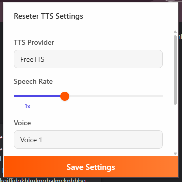
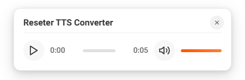

# Reseter TTS Converter

Reseter TTS Converter là một tiện ích mở rộng cho Chrome cho phép chuyển đổi văn bản thành giọng nói dễ dàng. Dự án sử dụng các nhà cung cấp như FreeTTS và OpenAITTS để thực hiện chuyển đổi, kèm theo giao diện người dùng đơn giản và hiện đại.

## Tính năng

- Chuyển đổi văn bản thành giọng nói trực tiếp trên trình duyệt.
- Hỗ trợ nhiều nhà cung cấp với cấu hình mặc định được thiết lập sẵn.
- Giao diện cài đặt dễ sử dụng với các tùy chọn thay đổi ngôn ngữ, tốc độ nói và giọng đọc.
- Hiển thị audio-player hiện đại với hiệu ứng animation và khả năng đóng nhanh gọn.
- Tự động lưu và tải cấu hình người dùng thông qua Chrome Storage.
- Tối ưu hóa văn bản với AI để chuẩn hóa nội dung, loại bỏ thông tin thừa và sửa lỗi chính tả trước khi chuyển đổi.

## Cài đặt

1. Tải về hoặc clone repository này về máy.
2. Mở Chrome và truy cập trang [chrome://extensions](chrome://extensions).
3. Bật chế độ "Developer mode" (Chế độ dành cho nhà phát triển).
4. Chọn "Load unpacked" và chọn thư mục project chứa file manifest.json.
5. Sau khi cài đặt, biểu tượng tiện ích sẽ xuất hiện trên trình duyệt.

## Cấu hình

Khi mở cửa sổ popup cài đặt:
- Người dùng có thể lựa chọn giữa các nhà cung cấp chuyển đổi (FreeTTS và OpenAITTS).
- Thay đổi tốc độ nói bằng thanh trượt điều chỉnh.
- Chọn ngôn ngữ (VI cho tiếng Việt, EN cho tiếng Anh) thông qua dropdown.
- Bật/tắt tính năng tối ưu hóa văn bản bằng AI, giúp chuẩn hóa nội dung trước khi chuyển đổi thành giọng nói.
- Các cấu hình mặc định được lưu trữ trên Chrome Storage để giữ nguyên khi đóng mở tiện ích.

## Cách sử dụng

1. Khi tiện ích được kích hoạt, người dùng có thể bôi đen văn bản cần chuyển đổi, sau đó click chuột phải để mở context menu và chọn "Speak with Reseter TTS Converter".
2. Nếu quá trình chuyển đổi đang diễn ra, audio-player sẽ hiển thị trạng thái loading.
3. Người dùng có thể nhấn nút "Save Settings" trên popup để lưu cấu hình đã thay đổi.
4. Nếu cần hủy chuyển đổi, có thể nhấn nút "Close" trên audio-player để dừng và đóng cửa sổ phát.
5. Khi bật tính năng "Optimize Text With AI", văn bản sẽ được tự động làm sạch và chuẩn hóa trước khi chuyển đổi, giúp cải thiện chất lượng đầu ra của giọng nói.

## Nhà cung cấp

- **FreeTTS**  
  - URL: `https://genai-reseter.servernux.com/api/v2/ttsv2-gen`  
  - Mặc định: tốc độ nói 1.0, giọng đọc là "1", ngôn ngữ là "vi"
  - Hỗ trợ tối ưu hóa văn bản với AI

- **OpenAITTS**  
  - URL: `https://genai-reseter.servernux.com/api/v2/ttsv1-gen`  
  - Mặc định: tốc độ nói 1.0, giọng đọc là "OA001"
  - Hỗ trợ tối ưu hóa văn bản với AI

## Hướng dẫn phát triển

- Các file chính trong dự án:
  - **manifest.json:** Định nghĩa cấu hình tiện ích.
  - **popup.html:** Giao diện cài đặt của tiện ích.
  - **assets/main.js:** Xử lý các thao tác liên quan đến cấu hình và giao diện.
  - **assets/content.js:** Tích hợp audio-player vào trang web.
- Mọi thay đổi cần được kiểm tra trên Chrome ở chế độ "developer mode".

## Đóng góp

Nếu bạn có ý kiến đóng góp hoặc muốn báo lỗi, hãy mở issue hoặc gửi pull request trên GitHub. Mọi ý kiến phản hồi sẽ được đón nhận nhiệt tình để cải thiện dự án.

## Tài liệu tham khảo

- [Make A README](https://www.makeareadme.com/)
- [banesullivan/README](https://github.com/banesullivan/README)
- [Awesome README](https://github.com/pottekkat/awesome-readme)

## Giấy phép

Dự án này được cấp giấy phép theo [MIT License](https://opensource.org/licenses/MIT).

## Liên hệ

Nếu có bất kỳ thắc mắc hay góp ý nào, vui lòng liên hệ theo địa chỉ email của dự án.
